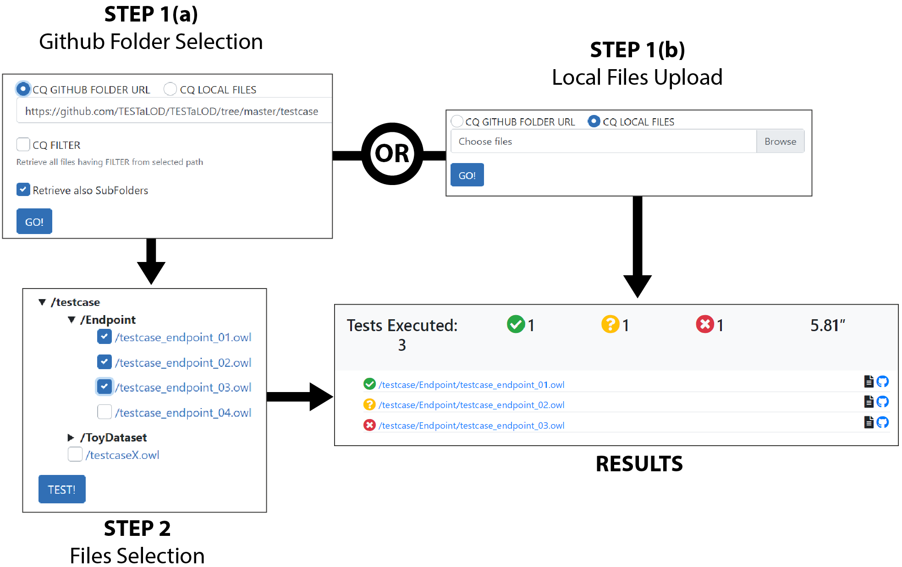

# TESTaLOD

TESTaLOD is a Web application designed for providing the XD methodology with a testing toolbox for supporting knowledge graph (KG) testing. XD is an iterative and incremental methodology, and involves different actors: 

 - a designer team, in charge of modelling a KG; 
 - a testing team, disjoint from the designer team, which takes care of testing the KG;
 - a customer team, who elicits the requirements that are translated into ontological commitments (i.e. competency questions and other constraints) that guide the KG development. 

TESTaLOD uses the [<i>TestCase</i> OWL meta model](http://www.ontologydesignpatterns.org/schemas/testannotationschema.owl) as the reference schema for representing unit tests, a means for validating ontology as well as data commitment. In such a schema, a unit test is modelled as a competency question (CQ) expressed in natural language and associated with a corresponding SPARQL query. Additionally, an expected result and a reference data sample can be provided. This allows one to validate the CQ by executing the SPARQL query with respect to the data sample, assessing the correspondence to the expected result. TESTaLOD implements a two-step workflow as presented in the Figure depicted below, which is powered by a Web-based user interface that allows a user to select and automatically execute an arbitrary number of defined test cases modelled by using the TestCase OWL meta model.

The first step requires a user to provide one or more test cases as input. Those test cases can be either retrieved from a Github repository (cf. step 1(a)) or directly uploaded from a local file system (cf. step 1(b)). When step 1(a) is selected by the user, TESTaLOD retrieves all the test cases available in the repository by recursively traversing the subfolders reachable from the repository root. After all the test cases are retrieved, the user is presented with an additional view (step 2). This view allows the user to decide whether or not to execute all the test cases found in the repository selectively. On the contrary, if step 1(b) is selected, then all uploaded local files are directly tested.
Both alternatives allow the user to visualise a view that reports the output of the automatic execution of the selected test cases. There are 3 possible outcomes resulting from the execution of a test case with TESTaLOD, i.e. (i) the test case is fully successful, thus the corresponding record in the user interface is green coloured; (ii) the test case is partially successful (the test results do not match completely the expected results), thus the corresponding record in the user interface is yellow coloured; (iii) the test case is fully unsuccessful, thus the corresponding record in the user interface is red coloured.

TESTaLOD has been designed and implemented in the context of the [ArCo project](https://w3id.org/arco). ArCo is the Italian Cultural Heritage knowledge graph, which is developed by following eXtreme Design (XD), focused on ontology design patterns (ODPs) reuse. The ArCo KG consists of a network of 7 vocabularies and 169 million triples about 820 thousand cultural entities. The testing activities have been carried out by using TESTaLOD: at each ArCo new realease (or minor change) all ArCo test cases have been executed on TESTaLOD to validate updates of the whole KG.
The test cases defined for the ArCo are publicly available on [GitHub](https://github.com/ICCD-MiBACT/ArCo/tree/master/ArCo-release/test/CQ). A running demo of TESTaLOD is available [online](http://testalod.herokuapp.com/). In the context of the demonstration track of the conference we will show how to use TESTaLOD in order to validate the requirements elicited for the ArCo project and represented as test cases formalised by using the TestCase OWL meta model.
